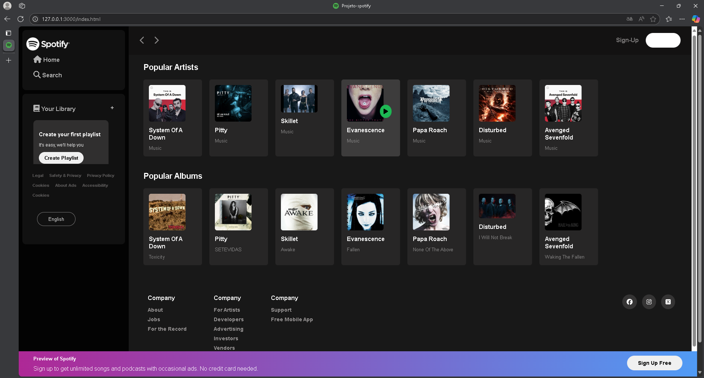

# 🎧 Clone da Interface do Spotify

Este projeto é uma reprodução da interface do Spotify, desenvolvido com HTML e CSS puro. O foco é praticar estruturação e estilização de interfaces modernas e responsivas.

## 🚀 Tecnologias utilizadas

## 📸 Preview

## 🔗 Acesse o projeto online

👉 [Clique aqui para ver o projeto ao vivo](http://127.0.0.1:3000/index.html)

## 📁 Estrutura do projeto

- `index.html`: Página principal com a estrutura da interface
- `style.css`: Estilos aplicados ao layout
- `/assets`: Imagens e ícones utilizados

## 🎨 O que foi desenvolvido

- Sidebar de navegação semelhante à do Spotify
- Seção de playlists e recomendações
- Layout responsivo (se aplicável)
- Player de música (apenas visual)

## 📄 Licença

Este projeto está sob a licença MIT - sinta-se livre para utilizá-lo e modificá-lo.
